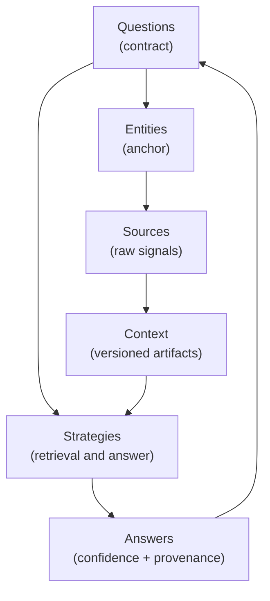
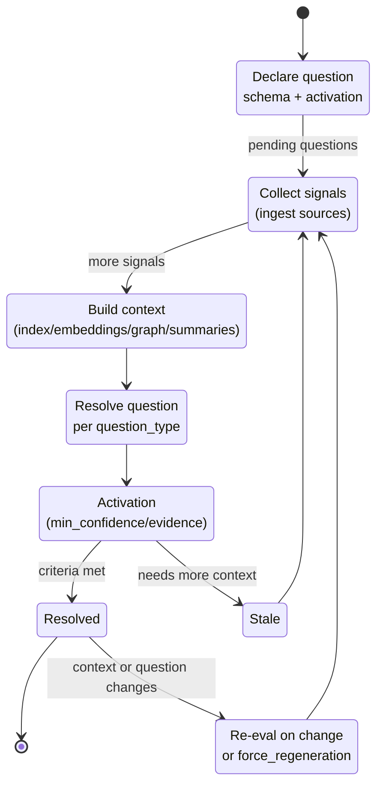

# Rationale

## Why this project exists
- Questions are the reason to have knowledge systems, yet most RAG-style tooling centers on retrieval mechanics and generation tactics, leaving the “what are we answering?” to downstream apps.
- Organizations hold fragmented knowledge about people, projects, and content; answers drift as context changes. A reusable, question-first module is needed to keep answers current and trustworthy across products.
- Entity Knowledge Queries makes questions the contract: you declare questions (with schemas and activation rules), and every artifact (indexes, embeddings, graphs, summaries) and pipeline step is there to resolve those questions with confidence and provenance. It stays product-agnostic so multiple use cases (Grants, content catalogs, CRM) can share the same backbone.

## Mental model
- **Questions as contracts**: Start from the questions. They carry output schemas and activation rules (`min_confidence`, evidence requirements). Retrieval and answer strategies are chosen to satisfy the question type.
- **Entities as anchors**: Everything attaches to an entity (person, project, content bundle) with tenant isolation. Ownership starts with the creator; access can be delegated via roles. Questions and answers live in the entity’s context.
- **Context as a versioned artifact**: Derived indexes/embeddings/graphs/summaries are versioned per entity; answers reference the context version used, enabling reproducibility and re-evaluation. New sources are ingested to improve pending questions.
- **Pipelines over glue code**: Ingestion -> encoding -> augmentation -> storage is configurable and driven by the questions’ needs. Profiles (`light`, `standard`, `rich`) tune cost vs. depth by entity type and question set.
- **APIs as the contract surface**: The Python backend issues tokens, enforces tenant/role scoping, and exposes the lifecycle: entities, sources, contexts, questions, answers, re-eval, webhooks. The UI manages tokens (admins) and lets users ask/view answers.
- **Evolution-first**: Defaults (FastAPI, Postgres/pgvector, S3-compatible blobs, Redis+Celery) are swappable; strategies and roles are configurable per tenant/entity type so the question-first spine remains stable as needs evolve.

## How to use this mental schema
- Begin with the questions and their schemas; only then decide ingestion/context/retrieval/answer strategies to satisfy them.
- When adding features, place them in the pipeline/strategy/contract model: define/adjust the question contracts, select or extend strategies, and record context/versioning impacts.
- Keep docs (`doc/DAT.md`, `doc/SPECIFICATIONS.md`, `doc/API.md`, `AGENT.md`) in sync with any change in contracts, defaults, roles, or token flows so downstream users rely on a single source of truth.

## Conceptual schemas

### Question-centric worldview

### Lifecycle: declare → resolve → evolve

